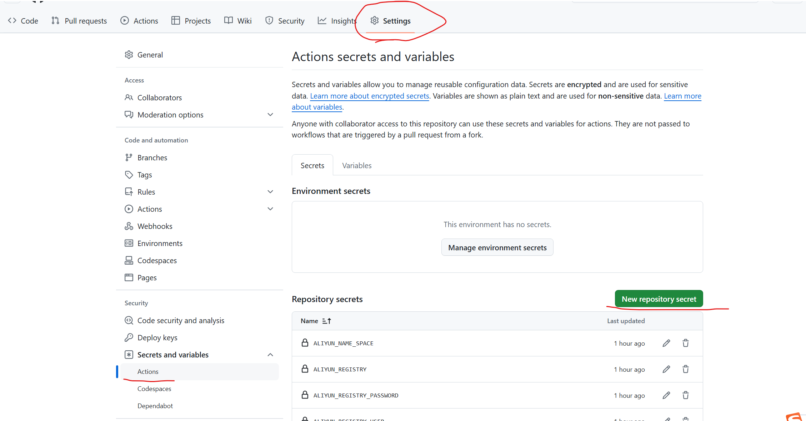
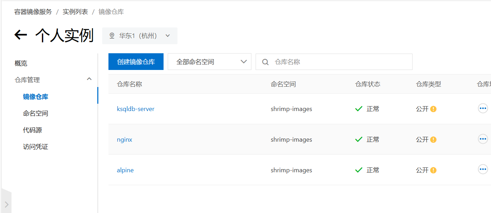

# Docker Images Pusher

使用Github Action将Docker镜像上传到阿里云供国内服务器使用，免费易配置

作者：**技术爬爬虾**<br>
B站，抖音，Youtube全网同名，转载请注明作者<br>

## 使用方式


### 配置阿里云
登录阿里云容器镜像服务<br>
https://cr.console.aliyun.com/<br>
启用个人实例，创建一个命名空间（**ALIYUN_NAME_SPACE**）


获取用户名（**ALIYUN_REGISTRY_USER**)<br>
密码（**ALIYUN_REGISTRY_PASSWORD**)<br>
仓库地址（**ALIYUN_REGISTRY**）<br>


### Fork本项目
Fork本项目<br>
进入您自己的项目，点击Action，启用Github Action功能
配置环境变量，进入Settings->Secret and variables->Actions->New Repository secret

将上一步的 ALIYUN_NAME_SPACE，ALIYUN_REGISTRY_USER，ALIYUN_REGISTRY_PASSWORD，ALIYUN_REGISTRY
的值配置成环境变量

### 添加镜像
打开images.txt文件，添加你想要的镜像，可以带tag，也可以不用（默认latest）
文件提交后自动进入Github Action构建

### 使用镜像
回到阿里云，镜像仓库，可以将镜像修改为公有。点击任意镜像，可查看镜像状态。


在国内服务器pull镜像：<br>
```
docker pull registry.cn-hangzhou.aliyuncs.com/shrimp-images/alpine
```
registry.cn-hangzhou.aliyuncs.com 即 ALIYUN_REGISTRY<br>
shrimp-images 即 ALIYUN_NAME_SPACE<br>
alpine 即images.txt里面填的镜像<br>
